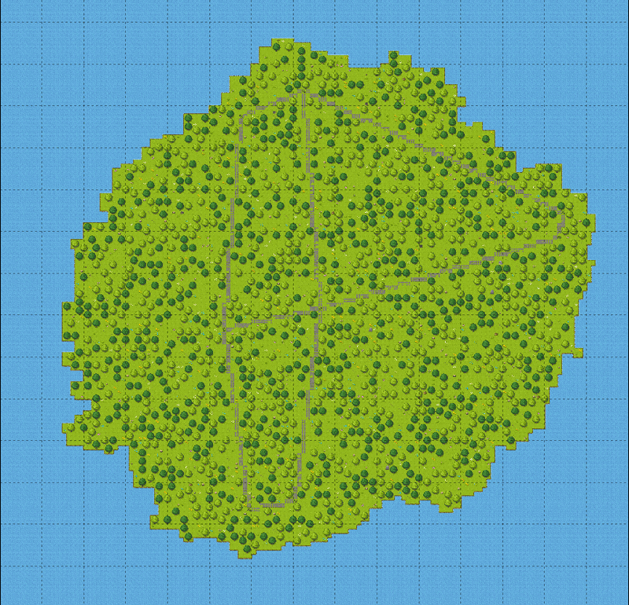
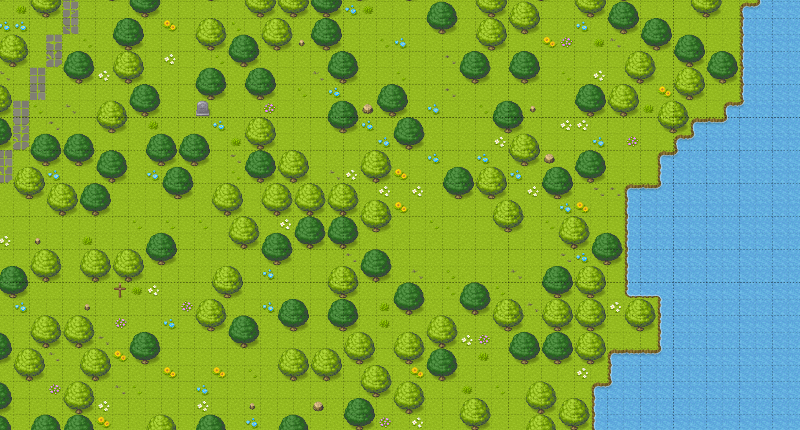

# Random Map Tile Generator
A Node.js application that randomly generates maps for 2D tile-based games using an XY grid system.

## Installation

    git clone https://github.com/iacoposk8/Random-Map-Tile-Generator
    cd Random-Map-Tile-Generator
    node index.js
The script will generate a tmx file that can be opened with [Tiled](https://www.mapeditor.org)

## Settings

To modify the generated map open the index.js file and you can modify:

    const single_tile = 32;

Which indicates the size in px of the base and height of a single tile and will be strictly linked to the size of the images of your tileset

    const map_size = [150,150];

Number of tiles for base and height of your final map

    var settings = [
	{
		"name": "Tileset file name (tsx)",
		"tilecount": Total number of tiles in the tileset,
		"objects":[
			{
				"type": "[Tile type](#type)",
				"layer": 0,
				"probability": 1,
				"tiles": [
					[
						[0]
					]
				]
			},
			...
		]
	}

### type
l = land
c = city (work in progress)
s = street
w = water. 
The code will create a matrix that will have one of these letters in each cell: l, c, s, w, and then it will replace these values with tiles, like a find and replace. 
There are also special characters: 
\* = any type, 
! = all types except w and l. 
For example when we want to use a "corner" tile, we have to look for a 9x9 matrix and we will replace only the center, for example:

## TODO

 - The generation of the roads needs improvement; they are very
   unnatural, too straight, and the curves are too rigid.  
 - Villages should emerge at the points where the roads intersect.

## Credits
The tilesets were taken from [RPG-JS](https://github.com/RSamaium/RPG-JS)
