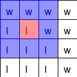

# Random Map Tile Generator
A Node.js application that randomly generates maps for 2D tile-based games using an XY grid system.

## Installation

    git clone https://github.com/iacoposk8/Random-Map-Tile-Generator
    cd Random-Map-Tile-Generator
    node index.js
The script will generate a tmx file that can be opened with [Tiled](https://www.mapeditor.org)

## Settings

To modify the generated map open the index.js file and you can modify:

    const single_tile = 32;

Which indicates the size in px of the base and height of a single tile and will be strictly linked to the size of the images of your tileset

    const map_size = [150,150];

Number of tiles for base and height of your final map

    var settings = [
	{
		"name": "Tileset file name (tsx)",
		"tilecount": Total number of tiles in the tileset,
		"objects":[
			{
				"type": "Tile type (full explanation below)",
				"layer": Integer from 0 and up (full explanation below),
				"probability": probability with which tiles will appear (full explanation below),
				"tiles": [
					list of tile ids (full explanation below)
				]
			},
			...
		]
	}

### type
The code will create a matrix that will have one of these letters in each cell: l, c, s, w, and then it will replace these values with tiles, like a find and replace. 
l = land
c = city (work in progress)
s = street
w = water. 

There are also special characters: 
\* = any type, 
! = all types except w and l. 
For example when we want to use a "corner" tile, we have to look for a 9x9 matrix and we will replace only the center, for example, the script generates this matrix:

The code will start making various substitutions, for example: \*w**l****
This 9 character string represents a 3x3 table, so:

 - characters 1, 2, and 3 will be cell 1, 2, and 3 of the first row
 - characters 4, 5, and 6 will be cell 1, 2, and 3 of the second row
 - characters 7, 8, and 9 will be cell 1, 2, and 3 of the third row

we can see it graphically like this:

In blue it is represented where there is the match between the two matrices, while in red, the central one, is where the substitution will be made:

The result will be:

At the end of all the substitutions of the type \*w**l**** and \*\*\*lw****
the result will be:

Now the matrix will look like this:

Now to replace the angle we use a search string like this: \*\*\*!w\*l!\*
Here's what the substitution match will be like:

This will be the result after the substitution:

And finally you can replace the last l (land) and w (water):

### layer
Integer from 0 and up. Usually 0 is enough for grass and water and 1 for everything else

### probability
Float from 0 to 1 indicates the probability with which tiles will appear. If 1 it will always appear (useful for the base of layer zero),

### tiles
array of arrays. If we have a list of elements that occupy a single tile, such as flowers, bushes, etc... we can write something like:

    [
    	[
    		[48] //flowers1
    	],
    	[
    		[49] //flowers2
    	],
    	[
    		[51] //bushes1
    	],
    	[
    		[51] //bushes2
    	],
    	...
    ]

If instead we have a 2 tree 2x2 tiles large we write:

    [
    	[ //tree1
    		[8,9],
    		[16,17]
    	],
    	[ //tree2
    		[10,11],
    		[18,19]
    	]
    ]
				
## TODO

 - The generation of the roads needs improvement; they are very
   unnatural, too straight, and the curves are too rigid.  
 - Villages should emerge at the points where the roads intersect.

## Credits
The tilesets were taken from [RPG-JS](https://github.com/RSamaium/RPG-JS)
